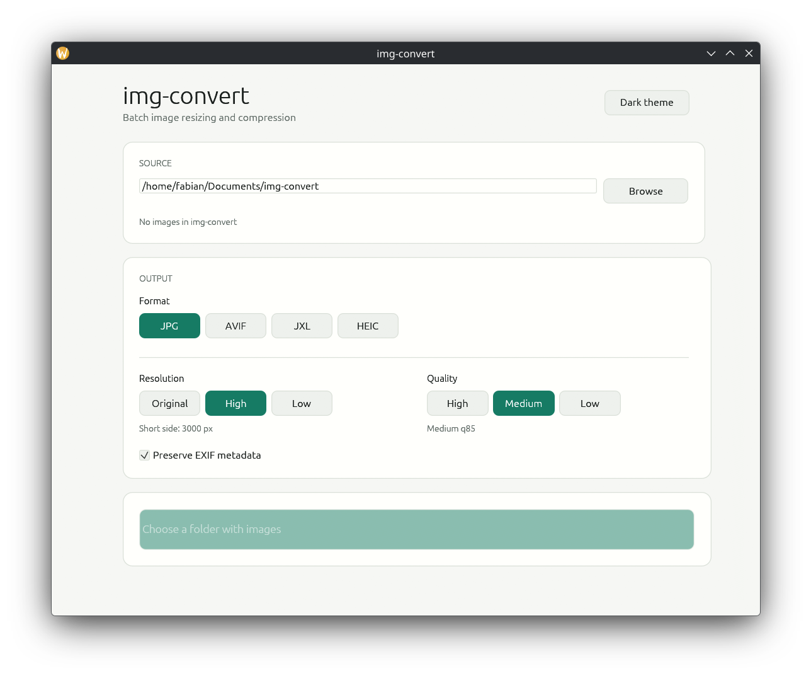
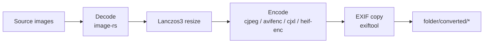

# img-convert

[](https://github.com/fabianwimberger/img-convert/actions/workflows/ci.yml)
[](https://opensource.org/licenses/MIT)

A small cross-platform desktop GUI for batch resizing and compressing folders of images to JPG, AVIF, JXL, or HEIC.

## Background

Photographers and content creators routinely need to push hundreds of RAW exports through the same resize-and-compress pipeline before publishing to web or mobile. Doing it through the encoder CLIs is fast but tedious; doing it through Photoshop or Lightroom is slow and heavy. This wraps the best-of-breed encoders (`cjpeg`, `avifenc`, `cjxl`, `heif-enc`) behind a small native UI so a folder can be batched in a few clicks, with EXIF passthrough and a JPEG → JXL lossless fast path.

<p align="center">
  
  <br><em>Pick a folder, choose format, resolution and quality, hit Convert — outputs land in <code>folder/converted/</code></em>
</p>

## Features

- **Batch processing** — convert an entire folder in parallel
- **Format choice** — JPG (`cjpeg`), AVIF (`avifenc`), JXL (`cjxl`), HEIC (`heif-enc`)
- **Wide input support** — JPEG, PNG, TIFF, WebP, GIF, BMP, ICO, TGA, QOI, PNM, EXR, HDR, DDS, Farbfeld
- **Lanczos3 resampling** — high-quality resize at the short side
- **JPEG → JXL fast path** — lossless transcode when no resize is needed
- **EXIF preservation** — copied via `exiftool` when available
- **Drag-and-drop** folder selection
- **Light / dark theme**
- **Cross-platform** — Linux, macOS, Windows

## Pipeline



## Quick Start

```bash
# Build
cargo build --release

# Run
./target/release/img-convert
```

## Install

Install into `~/.local/bin/img-convert`:

```bash
cargo install --path . --root ~/.local --force
```

Or use cargo's default location (`~/.cargo/bin/img-convert`):

```bash
cargo install --path . --force
```

## External Encoders

Only the encoders for formats you intend to use need to be on `$PATH`. The GUI shows availability and disables formats whose encoder is missing.

| Format | Command   | Typical package                   |
| ------ | --------- | --------------------------------- |
| JPG    | `cjpeg`   | `mozjpeg` / `libjpeg-turbo`       |
| AVIF   | `avifenc` | `libavif` / `libavif-utils`       |
| JXL    | `cjxl`    | `libjxl` / `jpeg-xl`              |
| HEIC   | `heif-enc`| `libheif` / `libheif-tools`       |
| EXIF   | `exiftool`| `perl-image-exiftool` / `exiftool`|

## Configuration

| Setting    | Options                                              |
| ---------- | ---------------------------------------------------- |
| Format     | JPG / AVIF / JXL / HEIC                              |
| Resolution | Original / High (3000 px) / Low (1440 px) short side |
| Quality    | High / Medium / Low (per-format quality mapping)     |
| EXIF       | Preserve / strip                                     |

## Contributing

See [CONTRIBUTING.md](CONTRIBUTING.md). Please report security issues privately — see [SECURITY.md](SECURITY.md).

## License

MIT License — see [LICENSE](LICENSE) file.

### Third-Party Tools

| Tool      | License                                                                  | Source                                  |
| --------- | ------------------------------------------------------------------------ | --------------------------------------- |
| mozjpeg   | [BSD-3-Clause / IJG](https://github.com/mozilla/mozjpeg/blob/master/LICENSE.md) | https://github.com/mozilla/mozjpeg      |
| libavif   | [BSD-2-Clause](https://github.com/AOMediaCodec/libavif/blob/main/LICENSE) | https://github.com/AOMediaCodec/libavif |
| libjxl    | [BSD-3-Clause](https://github.com/libjxl/libjxl/blob/main/LICENSE)        | https://github.com/libjxl/libjxl        |
| libheif   | [LGPL-3.0+](https://github.com/strukturag/libheif/blob/master/COPYING)    | https://github.com/strukturag/libheif   |
| ExifTool  | [Artistic / GPL](https://exiftool.org/#license)                          | https://exiftool.org/                   |
